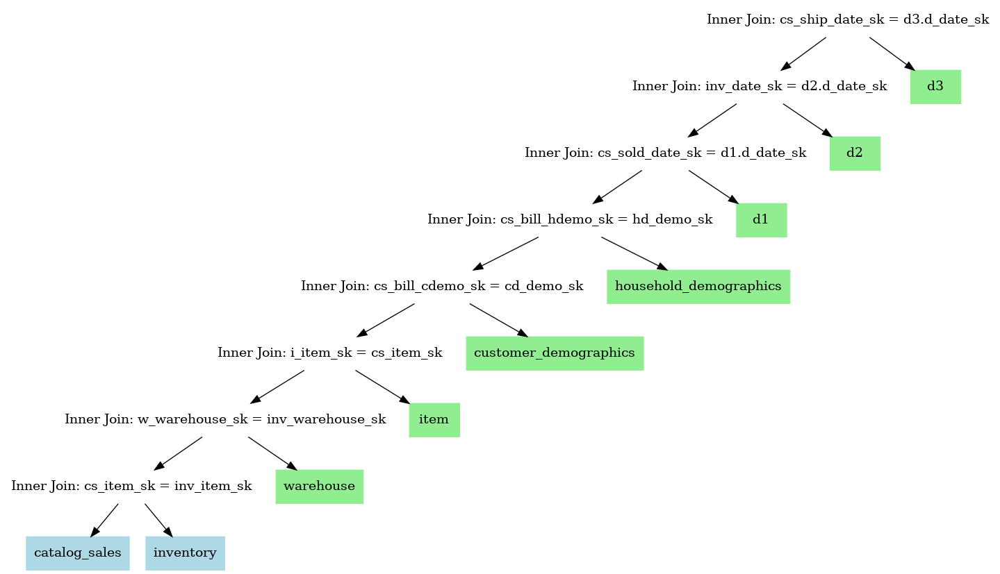

# Query Plan Markup Language (QPML)

QPML is a YAML-based DSL for describing query plans for the purposes of producing diagrams and textual representations
of query plans for use in documentation and presentations.

## Example

```yaml
title: 'Inner Join: cs_ship_date_sk = d3.d_date_sk'
inputs:
  - title: 'Inner Join: inv_date_sk = d2.d_date_sk'
    inputs:
      - title: 'Inner Join: cs_sold_date_sk = d1.d_date_sk'
        inputs:
          - title: 'Inner Join: cs_bill_hdemo_sk = hd_demo_sk'
            inputs:
              - title: 'Inner Join: cs_bill_cdemo_sk = cd_demo_sk'
                inputs:
                  - title: 'Inner Join: i_item_sk = cs_item_sk'
                    inputs:
                      - title: 'Inner Join: w_warehouse_sk = inv_warehouse_sk'
                        inputs:
                          - title: 'Inner Join: cs_item_sk = inv_item_sk'
                            inputs:
                              - title: catalog_sales
                                inputs: []
                              - title: inventory
                                inputs: []
                          - title: warehouse
                            inputs: []
                      - title: item
                        inputs: []
                  - title: customer_demographics
                    inputs: []
              - title: household_demographics
                inputs: []
          - title: d1
            inputs: []
      - title: d2
        inputs: []
  - title: d3
    inputs: []
```

## Tools

### Generate Text Plan

```shell
$ qpml print example1.yaml
```

```
Inner Join: cs_ship_date_sk = d3.d_date_sk
  Inner Join: inv_date_sk = d2.d_date_sk
    Inner Join: cs_sold_date_sk = d1.d_date_sk
      Inner Join: cs_bill_hdemo_sk = hd_demo_sk
        Inner Join: cs_bill_cdemo_sk = cd_demo_sk
          Inner Join: i_item_sk = cs_item_sk
            Inner Join: w_warehouse_sk = inv_warehouse_sk
              Inner Join: cs_item_sk = inv_item_sk
                catalog_sales
                inventory
              warehouse
            item
          customer_demographics
        household_demographics
      d1
    d2
  d3
```

### Generate Query Plan Diagram

```shell
qpml dot example1.yaml > example1.dot
dot -Tpng example1.dot > example1.png
```


