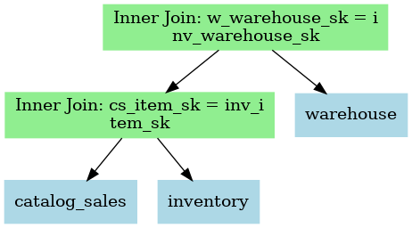

# Query Plan Markup Language (QPML)

QPML is a YAML-based DSL for describing query plans, expression trees, or any other tree structure, for the purposes 
of producing diagrams and textual representations for use in documentation and presentations.

Here is a minimal example of a qpml file. See [examples/example1.yaml](examples/example1.yaml) for a fuller example.

```yaml
diagram:
  title: 'Inner Join: w_warehouse_sk = inv_warehouse_sk'
  style: join
  inputs:
    - title: 'Inner Join: cs_item_sk = inv_item_sk'
      style: join
      inputs:
        - title: catalog_sales
          style: table
        - title: inventory
          style: table
    - title: warehouse
      style: table
styles:
  - name: table
    color: lightblue
    shape: rectangle
  - name: join
    color: lightgreen
    shape: rectangle
```

# Example Generated Output 

## GitHub Mermaid Diagram

```shell
$ qpml mermaid minimal.qpml > minmal.md
```


## GraphViz

```shell
qpml dot minimal.qpml > minimal.dot
dot -Tpng minimal.dot > minimal.png
```



## Text

```shell
$ qpml print minimal.qpml
```

```text
Inner Join: w_warehouse_sk = inv_warehouse_sk
  Inner Join: cs_item_sk = inv_item_sk
    catalog_sales
    inventory
  warehouse
```

# Creating QPML from Existing Query Plans

See the [QPML Documentation](./docs/README.md) for more information.
