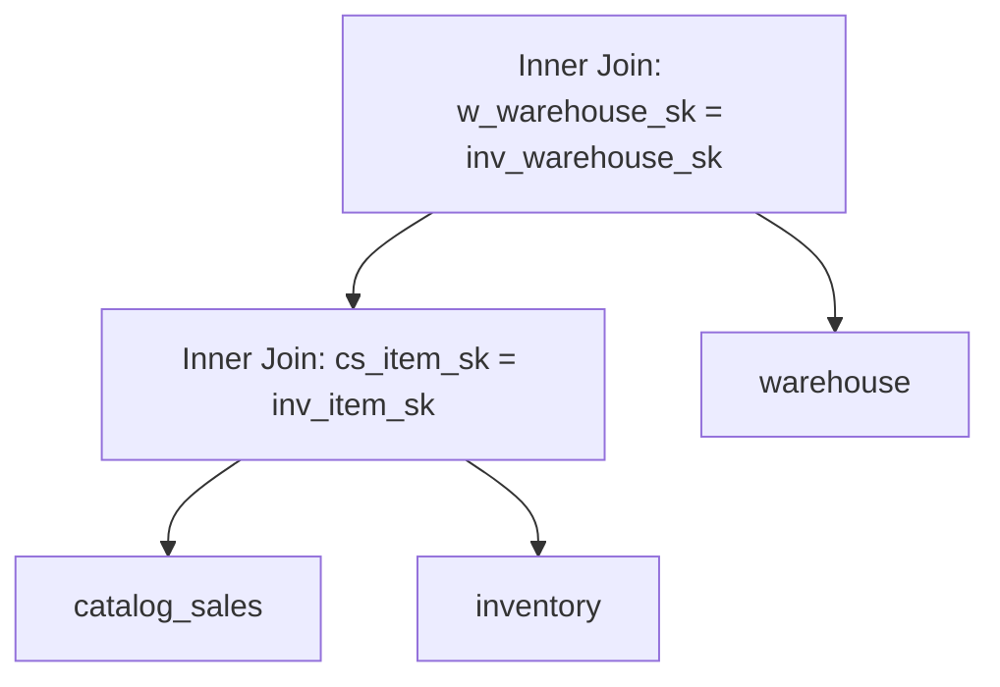

```mermaid
flowchart TD
node0[Inner Join: w_warehouse_sk = inv_warehouse_sk] --> node0_0[Inner Join: cs_item_sk = inv_item_sk]
node0_0[Inner Join: cs_item_sk = inv_item_sk] --> node0_0_0[catalog_sales]
node0_0[Inner Join: cs_item_sk = inv_item_sk] --> node0_0_1[inventory]
node0[Inner Join: w_warehouse_sk = inv_warehouse_sk] --> node0_1[warehouse]
```
